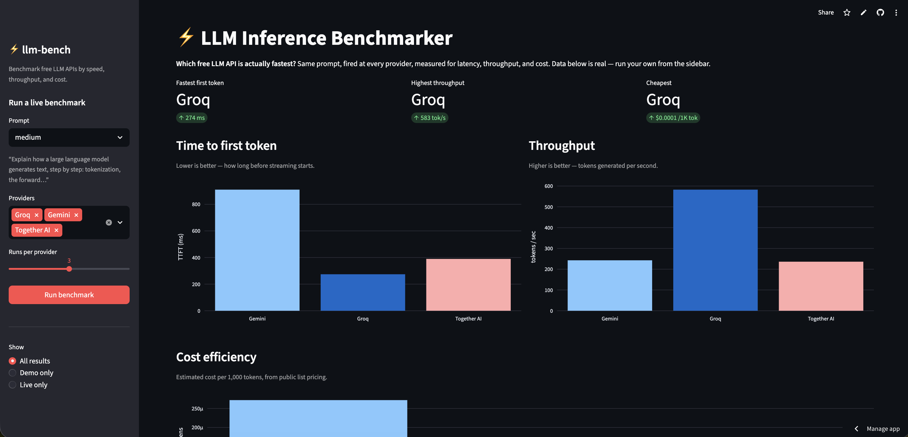
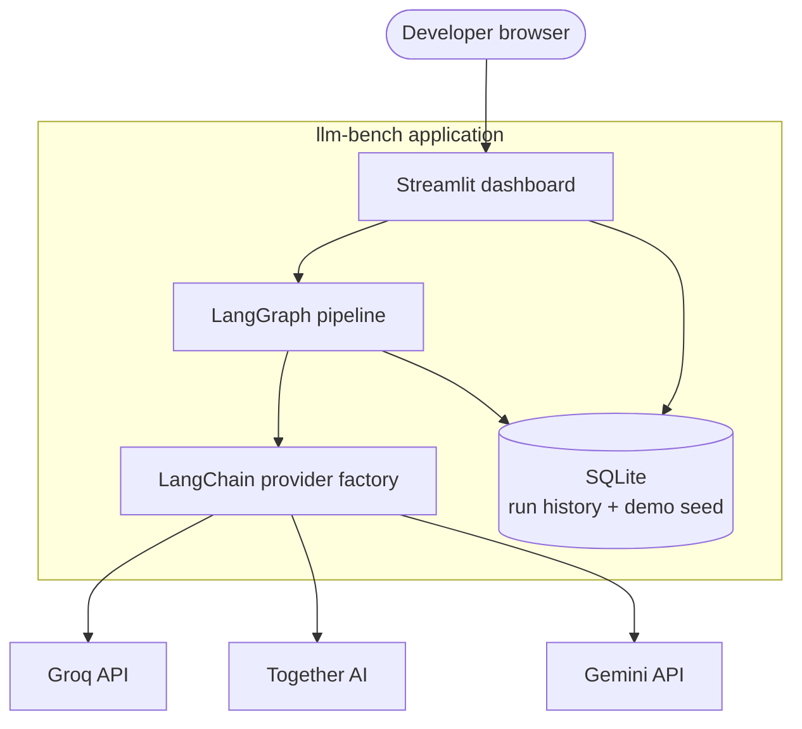
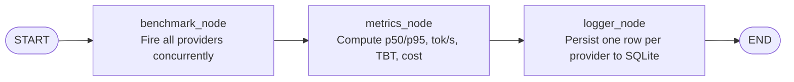

# ⚡ llm-bench

> Which free-tier LLM API is actually fastest? This benchmarks them properly.

**🔴 [Live demo →](https://llm-benchmarking-free.streamlit.app/)**



---

## TL;DR — Results

From the seeded benchmark (Llama 8B-class models on each provider, 3 runs × 2 prompts):

| Provider | TTFT (p50) | Throughput | Cost / 1K tokens |
|---|---|---|---|
| **Groq** (`llama-3.1-8b-instant`) | **~270 ms** | **~480 tok/s** | **~$0.0001** |
| Together AI (`Meta-Llama-3-8B-Instruct-Lite`) | ~295 ms | ~245 tok/s | ~$0.0001 |
| Gemini (`gemini-3.5-flash`) | ~865 ms | ~225 tok/s | ~$0.0003 |

**Groq wins on every axis for this workload.** Open the live demo and run your own prompts to compare against your use case.

---

## The problem

Free-tier LLM APIs have exploded — Groq, Together AI, Google Gemini, Mistral, OpenRouter. Every one of them claims to be fast. But which one is actually fastest *for your prompt*? Cheapest per token? Most consistent over repeated runs?

Most developers pick one and hope. This tool measures.

It fires the same prompt at multiple providers concurrently, captures real per-token streaming timings, and renders the comparison on a live dashboard you can read in ten seconds.

See [`PROJECT_RATIONALE.md`](PROJECT_RATIONALE.md) for the longer write-up of why this exists.

---

## What it measures

| Metric | What it tells you |
|---|---|
| **TTFT** (time-to-first-token) | How responsive it *feels* — when streaming visibly starts |
| **Inter-token latency (TBT)** | How smooth the stream is once it's going |
| **Tokens / sec** | Generation throughput |
| **Total latency** | End-to-end wall-clock time |
| **p50 / p95** | Typical *and* worst-case — i.e. reliability, not best case |
| **Cost / 1K tokens** | The economics, made comparable |
| **Success rate** | Whether the provider is actually dependable under repeat load |

---

## Architecture

A thin Streamlit UI over a LangGraph pipeline that fans out concurrent provider calls, computes aggregated metrics, and persists every run to SQLite.



### Pipeline (LangGraph state graph)

A shared `TypedDict` flows through three nodes. Each node mutates only the keys it owns; LangGraph merges the partial returns automatically, which is what makes the pipeline trivially extensible (adding a `grader_node` later = one `add_node` + one `add_edge`, nothing else changes).



**Concurrency model:** runs are fired *concurrently across providers* but *sequentially within a single provider*. Hammering one provider with N parallel requests inflates its latency via server-side queuing and would corrupt the very TTFT numbers we're trying to measure.

**Failure isolation:** a provider that errors out is recorded as a failed run, never an exception that aborts the cycle. Other providers still complete and still get logged.

---

## Quick start

```bash
git clone https://github.com/SarthakZende379/llm-bench.git
cd llm-bench
python3 -m venv venv && source venv/bin/activate
pip install -r requirements.txt
cp .env.example .env
# Edit .env and add your real keys for Groq, Gemini, Together AI

streamlit run app.py
```

You'll see the pre-seeded demo data immediately. Use the sidebar to fire a fresh live benchmark with your own keys.

### Regenerate the seeded data

```bash
python seed_demo_data.py
```

Runs the actual benchmark across all providers and freezes the results into `data/results.db` with `is_demo=1`. Safe to re-run — it clears prior demo rows first.

### Test individual modules

```bash
python providers.py groq        # smoke-test one provider
python metrics.py together      # run 3 cycles and aggregate
python logger.py                # end-to-end: pipeline -> SQLite -> readback
```

---

## Tech stack

| Layer | Tool | Why |
|---|---|---|
| LLM abstraction | LangChain | Swap providers by changing one registry entry |
| Pipeline orchestration | LangGraph | State graph keeps the flow extensible |
| Async execution | `asyncio` | Fire providers concurrently, not sequentially |
| Persistence | SQLite | Zero infra, queryable, ships with the app |
| Dashboard | Streamlit + Plotly | Free hosting, fast to build, public URL |

---

## Project structure

```
llm-bench/
├── app.py                # Streamlit dashboard (entry point)
├── pipeline.py           # LangGraph state, dataclasses, three-node graph
├── providers.py          # LangChain factory + streaming benchmark runner
├── metrics.py            # p50/p95, throughput, cost math (pure functions)
├── logger.py             # SQLite persistence layer
├── prompts.py            # Benchmark prompt sets
├── seed_demo_data.py     # Generates frozen real demo data
├── data/results.db       # Seeded demo data (committed)
├── requirements.txt
├── .env.example
├── PROJECT_RATIONALE.md  # The why behind the project
└── README.md
```

---

## Key design decisions

**Tokens/sec is measured over end-to-end time, not just the decode window.** Providers buffer their streams differently — Gemini sends a few large chunks, Groq streams token-by-token — and a decode-window rate rewards buffering with inflated, non-comparable numbers. Total-time throughput is robust to that and matches what a user actually experiences.

**Output tokens are estimated from response text (~4 chars/token).** Streaming chunk counts vary by how aggressively each provider buffers, so a text-based estimate is the only consistent cross-provider basis for throughput and cost.

**TBT is reported when available, omitted when not.** A single-chunk stream has no inter-token gaps to measure — that's honest, not broken.

**Multiple runs per provider.** Single-shot timings are noise. The default is 3 runs per provider per cycle (configurable up to 5 in the UI), so the dashboard reports p50 *and* p95 — typical and tail.

**Hybrid deployment.** The app ships with pre-seeded real benchmark data so the dashboard tells its story the instant a visitor opens it — zero setup, zero key entry. The "Run benchmark" button uses the deployed instance's own API keys (Streamlit Secrets), so visitors never have to provide their own.

**Bridging Streamlit secrets into env.** A small helper copies `st.secrets` into `os.environ` at startup so `providers.py` can be framework-agnostic (it just reads env vars) and work identically locally, in CLI, or on Streamlit Cloud.

---

## Real findings surfaced during the build

These came up while wiring the providers, and they're worth keeping because they *prove the tool's premise*:

- **Together AI:** the Llama 3 8B model that used to be serverless now requires a paid dedicated endpoint. The serverless path moved to a different model name (`Meta-Llama-3-8B-Instruct-Lite`).
- **Gemini:** free-tier request quota can be `0` for a given model. The current model identifier (`gemini-3.5-flash`) changes faster than tutorials keep up with, and the model is a *thinking model* — without disabling the thinking budget it silently consumes all output tokens before producing visible text.
- **Streaming buffering:** Gemini buffers short responses into 1–2 chunks; Groq token-streams. This silently breaks naive decode-throughput measurement on short prompts — fixed by using substantial benchmark prompts *and* measuring throughput end-to-end.

Neither is a toy-project hiccup. They're exactly the operational friction the tool exists to expose: free-tier availability and pricing are a moving target, and the only way to know the current reality is to measure it.

---

## What I'd add next

- **More providers:** Mistral, OpenRouter, Cerebras (the LPU competitor that also advertises ~thousands of tokens/sec)
- **Long-running mode:** fire N runs over an hour and graph latency over time — catches throttling that single-shot benchmarks miss
- **LLM-as-judge node:** an extra graph node that grades response quality, so the dashboard shows speed *and* quality side by side
- **OpenTelemetry / Prometheus export:** so the same per-run metrics can feed a production observability stack, not just the local SQLite
- **Multi-prompt comparison view:** show how each provider behaves across short, medium, and long inputs in a single chart

---

## License

MIT